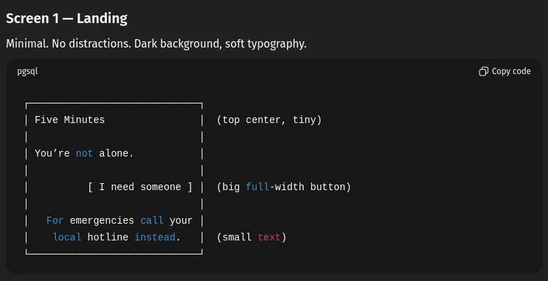
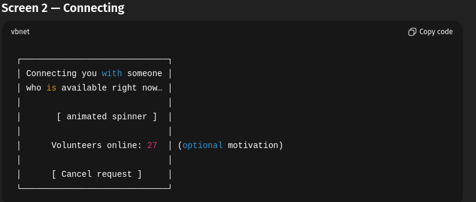
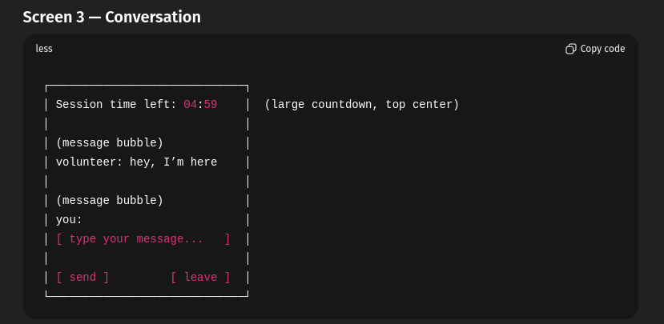
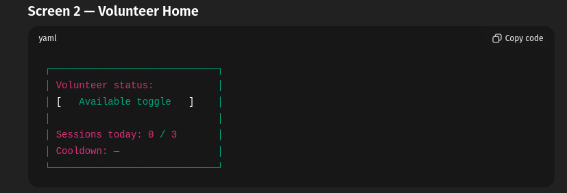

# 📱 **Wireframe Set A: Help-seeker Flow**

Behavior:

- Tap button → go to Connecting screen.
    

---

If no volunteer is found after 20 seconds:

`No one is currently available. Please try again or reach emergency support.`

---

End of session:  
Fade out chat → modal

`Time is up. Thank you for being here.  Everything has been erased.`

Button: `Start another session` (same flow as beginning)

---

# ❤️ **Wireframe Set B: Volunteer Flow**

## **Screen 1 — Onboarding tutorial**

Slides with short examples.

`Listening matters more than fixing. You don’t have to solve anything. Just be here.  [ Next ]`

Next slide:

`Avoid giving advice. Avoid judgment. Avoid asking for identity.  [ Next ]`

Final slide:

`You are offering 5 minutes of presence. That’s enough.  [ Become a volunteer ]`

---

If a request comes in:  
Modal Notification:

`Someone needs to talk right now. Accept session?  [ Accept ]   [ Decline ]`

---

## **Screen 3 — Conversation (same as user)**

Except bottom bar shows:

`[ Leave conversation ] [ Tools/help ]`

Tools menu:

- Grounding prompts list
    
- Quick suggestions like:
    
    - “I hear you.”
        
    - “You’re safe to talk here.”
        
    - “It’s okay to feel overwhelmed.”
        
    - “Thank you for trusting me.”
        

---

# 🌫 **Design Philosophy Notes**

- Dark mode default, soft grays/blues
    
- Rounded elements, no sharp edges
    
- No avatars, no usernames, no identity markers
    
- Timer as the anchor visual element
    
- Quiet and calm UI much more than decorated

# **Implementation Task List (MVP Build Plan)**

Structured as **engineering tasks**, ordered for logical development.

## **Phase 1 — Core Foundation**

### Backend

- Initialize repository (backend + mobile folders)
    

- Create FastAPI skeleton
    

- Create anonymous token generation endpoint
    

- Implement WebSocket connection endpoint
    

- Implement Redis matching queue service
    

- Implement 1-to-1 channel assignment
    

- Implement 5-minute session timer logic (server-side enforcement)
    

- Auto-disconnect + cleanup event
    

### Mobile App (Flutter)

- Create blank project
    

- Implement landing screen UI
    

- Implement “I need someone” button + API request
    

- Add connecting screen with status polling
    

- Implement WebSocket messaging view
    

- Add visible countdown timer
    

- Auto-close UI on timeout
    

- Add “Cancel / Leave session” actions
    

### Infra

- Dockerize backend
    

- Local docker-compose setup (backend + Redis)
    

- Basic CI/CD workflow skeleton
    

---

## **Phase 2 — Volunteer System**

### Backend

- Volunteer onboarding endpoints (set status available/unavailable)
    

- Push notification trigger when matching request appears
    

- Accept or reject session endpoint
    

### Mobile App

- Volunteer onboarding tutorial screens
    

- Status toggle screen
    

- Notification handling
    

- Accept session flow
    

---

## **Phase 3 — Moderation + Safety**

### Backend

- Basic keyword filter for personal data
    

- Auto-terminate & flag mechanism
    

- Simple strike-based banning system
    

### Mobile

- Warning system for blocked messages
    

- Add grounding suggestions for volunteers
    

---

## **Phase 4 — Deployment**

- Set up Traefik reverse proxy
    

- Deploy backend to test environment (Lightsail / DO)
    

- Connect Firebase push notifications
    

- Enable HTTPS + certs
    

---

## **Phase 5 — Polish**

- UI refinements (spacing, typography)
    

- Empty state handling
    

- Analytics (not content logging, just session counts)
    

Emergency fallback screen if no volunteers found

# **Deliverables**

|Item|Output|
|---|---|
|Wireframes|Done|
|Task breakdown|This|
|Safety spec (initial)|Next|
|Repo scaffolding|After that|
|System architecture doc|Already done (expand later)|

---

# **Dependencies**

|Requirement|Notes|
|---|---|
|Firebase|Push notifications|
|Redis|Matching + ephemeral store|
|Domain + SSL|Needed for deployment|
|App store accounts|Eventually|
